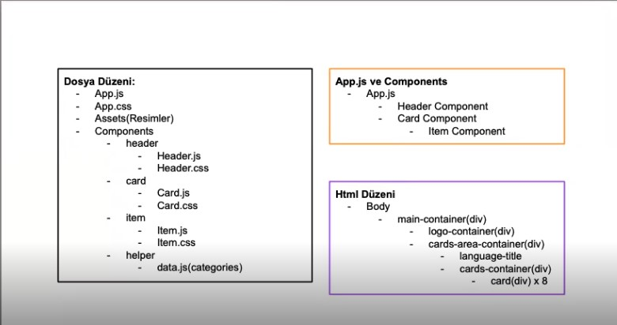
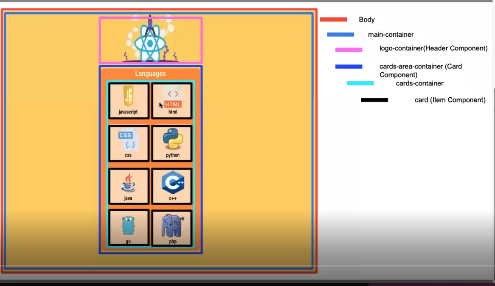

# react-language-cards

# Getting Started with Create React App
    npx create-react-app react-language-cards
   
   cd react-language-cards
   npm start
## overview

## overview

## src/components/header/header.js

import React from "react";
import reactLogo from "../../assets/react.svg";
import "./header.css";

const Header = () => {
    return(
        

            
        

    )
}

export default Header;

## src/components/header/header.css
.logo-container{
    margin: 10px 0;
}

.react-logo{
    height: 150px;
}

## App.js

import './App.css';
import Header from "./components/header/header"

function App() {
  return (
    

      <Header/>
    

  );
}

export default App;
## src/components/helper/data.js
import css from "../assets/css.png";
import python from "../assets/python.png";
import java from "../assets/java.png";
import cpp from "../assets/cpp.png";
import go from "../assets/go.png";
import php from "../assets/php.png";
import javascript from "../assets/javascript.png";
import html from "../assets/html.png";

export const categories = [
  {
    name: "javascript",
    img: javascript,
    options: ["Website Development", "1995", "Brendan Eich"],
  },
  {
    name: "html",
    img: html,
    options: ["Website Development", "1993", "Tim Berners-Lee"],
  },
  {
    name: "css",
    img: css,
    options: ["Website Design", "1994", "Håkon Wium Lie"],
  },
  {
    name: "python",
    img: python,
    options: ["AI", "1980", "Guido van Rossum"],
  },
  {
    name: "java",
    img: java,
    options: ["BackEnd", "1990s", "Sun Microsystems"],
  },
  {
    name: "c++",
    img: cpp,
    options: ["Game Dev.", "1980s", "Bjarne Stroustrup"],
  },
  {
    name: "go",
    img: go,
    options: ["Network", "2009", "Robert Griesemer"],
  },
  {
    name: "php",
    img: php,
    options: ["BackEnd", "1995", "	Rasmus Lerdorf"],
  },
];

